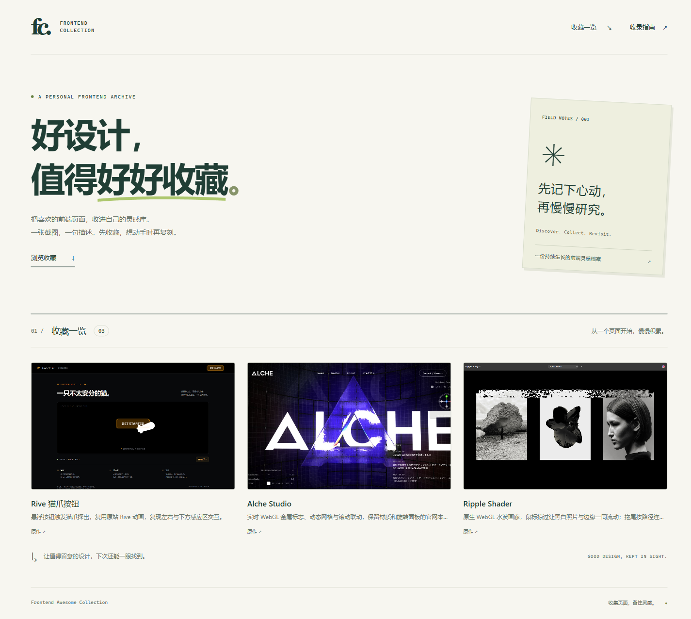

<div align="center">

# Frontend Awesome Collection

**收集优秀前端作品，用复刻把设计灵感变成实现能力。**

发现好设计 · 拆解好交互 · 动手复刻 · 沉淀经验

[作品画廊](showcase/README.md) · [灵感收藏](collection.md) · [项目索引](#项目索引) · [功能进度](#功能进度) · [学习笔记](notes/README.md) · [新增项目](#新增项目)

</div>

---

## 关于这个仓库

这是我的前端优秀项目复刻与收集仓库，用来记录值得学习的网站、页面和交互，并通过实际编码理解它们的实现方式。

不只收藏链接，也不止于“看起来像”。希望每一次复刻，都能留下可运行的作品、可回看的实现记录，以及下一次可以复用的经验。

这里计划收录：

- **网站与页面复刻**：品牌官网、产品落地页、作品集、后台界面等。
- **组件与交互实验**：导航、卡片、弹窗、拖拽、滚动联动等局部体验。
- **动效与视觉探索**：页面转场、微交互、创意排版及其他视觉表现。
- **拆解与复盘笔记**：设计观察、技术选型、实现难点和改进思路。

## 网页作品画廊

独立的 [showcase 截图收藏墙](showcase/README.md)，以“页面截图 + 项目名称 + 一行描述”直观展示收集的优秀前端项目。**推荐一并收录源码，方便研究实现与后续复刻；但画廊展示不依赖源码，有无源码都能展示截图和描述。** 原作、源码仓库及演示链接可按实际情况补充，无需提供 live 演示或部署到公网。已收录 [Rive 猫爪按钮](projects/rive-cat-paw/README.md)、[Alche Studio](projects/alche-studio/README.md) 与 [Ripple Shader](projects/ripple-shader/README.md)，可在收藏墙查看截图与描述。



*画廊实际页面截图（2026-09-11），展示已收录的 Rive 猫爪按钮、Alche Studio 与 Ripple Shader。截图为静态预览，查看收藏墙请按下方方式启动。*

使用 Node.js 22+，无需安装第三方依赖。在仓库根目录运行：

```sh
cd showcase
npm run dev
```

浏览器打开 `http://127.0.0.1:5173`。保存后手动刷新页面。

新增展示作品只需将封面放入 `showcase/public/covers/`，并在 `showcase/src/data/projects.json` 中添加记录；具体字段、构建与部署方式见[展示站说明](showcase/README.md)。截图收藏可以先于复刻存在；网页收藏清单与本页复刻索引分别维护。

## 项目索引

已收录 Rive 猫爪按钮交互演示、Alche Studio 官网本地化复刻与 Ripple Shader 水波交互实验。这里仅索引已开始实现的作品；尚未动手的项目也可以直接加入截图收藏墙，并在[收藏清单](collection.md) 中记录来源和看点。

| 项目 | 原作 / 灵感来源 | 技术栈 | 学习重点 | 在线预览 | 状态 |
| --- | --- | --- | --- | --- | --- |
| [Rive 猫爪按钮](projects/rive-cat-paw/README.md) | [Rive for game UI](https://rive.app/game-ui) | HTML / CSS / JavaScript / Rive | 透明感应区、状态机、离线资源打包 | 未部署；[本地运行说明](projects/rive-cat-paw/README.md#技术栈与本地运行) | 已完成 |
| [Alche Studio](projects/alche-studio/README.md) | [Alche, Inc](https://alche.studio/) | HTML / CSS / JavaScript / Three.js / Node.js | WebGL 金属材质、滚动联动、静态资源本地化 | 未部署；[本地运行说明](projects/alche-studio/README.md#技术栈与本地运行) | 已完成 |
| [Ripple Shader](projects/ripple-shader/README.md) | [Olivier Larose · Ripple Shader](https://blog.olivierlarose.com/demos/ripple-shader) | HTML / CSS / JavaScript / WebGL | 离屏位移纹理、连续路径采样、动态对象池与自然衰减 | 未部署；[本地运行说明](projects/ripple-shader/README.md#打开方式) | 已完成 |

作品状态使用 `进行中`、`已完成` 或 `持续优化`。状态更新只修改索引，不移动项目目录。

## 功能进度

仅列出收藏墙的实际功能；待完成项为候选计划，不包含目录规范、开发流程或内容收录任务。

### 已完成

- [x] **截图画廊**：以卡片展示收藏项目的截图、名称和简短描述。
- [x] **多端浏览**：根据手机、平板和桌面屏幕自动调整卡片布局。
- [x] **关联链接**：为收藏附加原作、源码、说明或演示入口，全部可选。

### 待完成

- [ ] **关键词搜索**：按项目名称或描述查找收藏。
- [ ] **分类筛选**：按项目类型或技术栈筛选收藏。
- [ ] **截图放大预览**：在当前页面查看截图大图。
- [ ] **README 索引同步**：根据收藏清单自动生成 README 中的收藏索引。

## 复刻关注点

| 维度 | 关注内容 |
| --- | --- |
| 视觉还原 | 布局、字体、配色、间距、层次与素材呈现 |
| 交互体验 | 悬停、点击、滚动、状态切换及操作反馈 |
| 动效细节 | 节奏、缓动、过渡衔接与动画触发时机 |
| 响应式适配 | 不同屏幕尺寸下的布局变化与操作方式 |
| 工程实现 | 组件拆分、样式组织、代码可读性与复用 |
| 基础质量 | 语义化、键盘操作、加载体验与性能表现 |

不要求每个项目都完整复刻原站。可以只聚焦一个页面、一组组件或一段交互，但应在项目说明中写清楚实现范围和已知差异。

## 如何使用

想找灵感，可以先浏览[收藏清单](collection.md)；想看通用经验，可以阅读[学习笔记](notes/README.md)。查看复刻作品时：

1. 在 **项目索引** 中选择感兴趣的作品。
2. 进入对应项目目录，阅读该项目的 `README.md`。
3. 按项目说明安装依赖、启动预览，或查看在线演示。
4. 结合源码和复盘记录，了解设计细节与实现取舍。

不同作品可以使用不同技术栈。运行环境、包管理器和启动命令以各项目说明为准，本仓库不提供所有复刻项目的统一启动命令；展示站单独运行。

## 目录组织

采用“集中收藏 + 独立作品 + 通用笔记”的结构，并用独立画廊展示作品：

```text
frontend-awesome-collection/
├── README.md                 # 仓库介绍与作品索引
├── collection.md             # 灵感来源、设计看点与复刻计划
├── projects/                 # 已开始实现的独立作品
│   └── README.md             # 项目组织与新增约定
├── notes/                    # 跨项目可复用的学习笔记
│   └── README.md             # 笔记说明与索引
└── showcase/                 # 独立的网页作品画廊
    ├── README.md             # 运行与收录指南
    ├── public/covers/        # 作品展示封面
    └── src/data/projects.json # 网页作品清单（其他站点源码略）
```

### 单个作品如何组织

开始复刻后，在 `projects/` 下新增作品目录。以下仅为示例，尚未创建：

```text
projects/studio-portfolio/
├── README.md                 # 原作、运行方式、实现范围与复盘
├── screenshots/              # 原作参考图与复刻效果图
├── public/                   # 项目运行所需的静态资源
├── src/                      # 源码
├── package.json              # 项目依赖与脚本
└── ...                       # 项目配置及对应包管理器的锁文件
```

`src/`、`public/` 和 `package.json` 按技术选型决定，并非硬性要求；纯 HTML 项目可以直接从 `index.html` 开始。

### 组织原则

- **收藏与实现分开**：截图与描述可直接加入收藏墙，详细来源记在 `collection.md`；无需提前创建空项目。
- **按作品组织**：不按 React、Vue 等技术栈分顶层目录，技术栈记录在作品索引中。
- **路径保持稳定**：使用小写英文与短横线命名，不因完成状态变化而移动目录。
- **每个项目独立**：自行管理依赖、配置和运行命令，暂不引入统一工作区或共享组件包。
- **专属内容就近存放**：截图、素材和项目复盘随作品保存；通用经验再整理到 `notes/`。

## 新增项目

### 只做截图收藏

1. 将项目截图放入 `showcase/public/covers/`。
2. 在 `showcase/src/data/projects.json` 中填写唯一标识、名称、描述和截图路径。
3. 刷新收藏墙即可查看；原作、源码、说明及演示链接都可以不填。

推荐在获取到源码时一并收录，并注明来源；也可以补充源码仓库链接，方便后续学习。暂时没有源码不影响加入画廊，无需为展示启动演示或创建复刻项目目录。详细笔记可记录在 `collection.md`。

### 以后想动手复刻时

以下流程仅用于实际编码，不是加入截图收藏墙的前置条件。

1. **先收藏**：在 [collection.md](collection.md) 中记录原作名称、链接、看点和复刻意向。
2. **确定范围**：明确本次复刻哪些页面、组件或交互，以及暂不实现的部分。
3. **开始实现**：创建 `projects/<project-name>/`，按作品需要选择技术栈和内部结构。
4. **补充说明**：使用下方模板编写项目 README，记录运行方式、效果截图与实现笔记。
5. **建立导航**：在首页项目索引中添加作品目录链接，在收藏清单中补充本地项目链接。
6. **加入画廊**：准备展示封面，在 `showcase/src/data/projects.json` 中添加作品信息与可用链接。
7. **持续维护**：同步更新两处状态；可复用的经验整理到 `notes/`，并更新笔记索引。

### 单项目 README 模板

可以复制以下结构，根据项目实际情况补充：

```markdown
# 项目名称

一句话介绍原作特点与本次复刻的学习目标。

## 原作与灵感
- 原作名称与链接：
- 作者 / 团队（如已知）：
- 值得学习的设计或交互：

## 预览
- 在线演示（如有）：
- 截图或录屏：

## 实现范围
- 已完成：
- 未实现 / 与原作的差异：

## 技术栈与本地运行
- 技术栈与运行环境版本：
- 包管理器：
- 安装、启动与构建命令：

## 实现笔记
- 关键实现与技术取舍：
- 遇到的问题及解决方式：
- 后续改进：

## 素材与致谢
- 图片、字体、图标及代码片段的来源与许可说明：
```

## 来源与致谢

感谢提供灵感的设计师、开发者与开源项目。各复刻项目应注明原作及素材来源，区分原创实现、参考代码与第三方资源。

本仓库以个人学习与实践记录为目的，复刻作品不代表原站或原作者的官方实现。代码与素材的许可信息应在对应项目中单独说明。

---

**把看到的好设计，变成写得出的好作品。**
