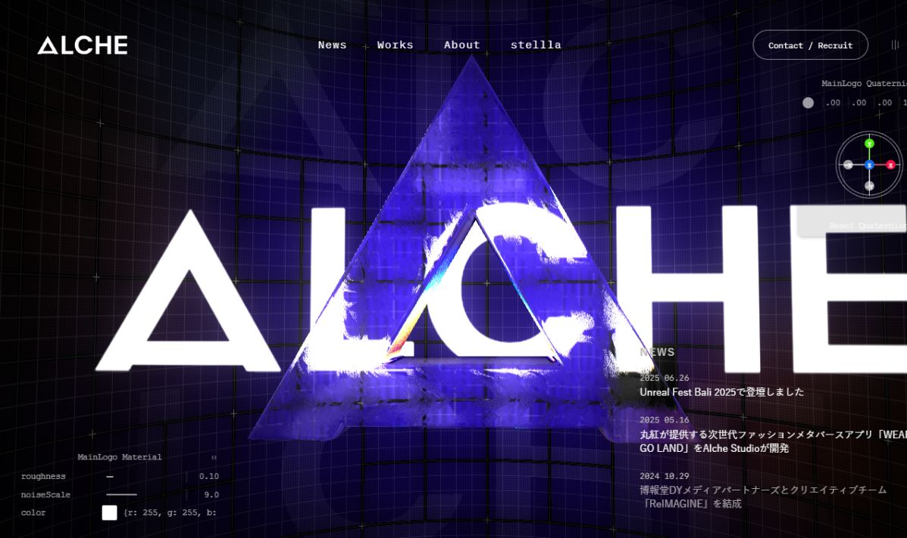

# Alche Studio — 本地高保真复刻

基于 `https://alche.studio/` 在 **2026-09-09** 公开提供的静态页面、样式、脚本及媒体资源制作。

[返回项目索引](../../README.md#项目索引) · [灵感收藏](../../collection.md)

## 原作与灵感

- 原作：Alche, Inc — https://alche.studio/
- 学习重点：Three.js / WebGL 金属材质、环境反射、滚动驱动场景与交互调节面板。
- 收录性质：原站公开构建产物本地化，并补充本地服务、测试和辅助功能；不冒充原创源码实现。

## 预览



未部署到公网。截图来自本地运行页面；画廊无需启动本项目即可展示封面。

## 技术栈与本地运行

技术栈：HTML / CSS / JavaScript、原站 Three.js / WebGL 构建脚本、Node.js；使用 npm 脚本。

在本项目目录运行（与画廊同时启动时建议使用 5175 端口）：

```powershell
cd D:\frontend-awesome-collection\projects\alche-studio
npm run dev -- --port 5175
```

访问 `http://localhost:5175/`。默认启动方式如下：

要求 Node.js 20 或更高版本，无需安装 npm 依赖。

```powershell
npm run dev
```

浏览器打开 `http://localhost:5173`。自定义端口：

```powershell
npm run dev -- --port 3000
```

请通过 HTTP 服务访问，不要直接双击 HTML：WebGL 模型、ES modules 和页面切换需要 HTTP。

## 包含内容

- 首页实时 WebGL 金属标志、环境反射、动态网格和背景。
- 滚动驱动的 Works、Mission、Vision、Service、stellla 展示。
- 作品列表、分类筛选、分页及 17 个作品详情页。
- News、About、stellla、Contact、Privacy Policy、License 等页面。
- 共 36 个 HTML 页面、643 个原站资源文件，约 54.7 MB。
- 原有页面过渡、移动端菜单、声音启用提示及静音切换。
- 额外提供键盘焦点样式、跳转正文链接及菜单辅助功能状态。

## 实现方式与边界

这是**原站公开构建产物的本地化版本**，不是重新编写的 React/Vue 工程，也不包含原站未公开的 Astro/TypeScript 组件源码。采用这种方式是为了完整保留原站较复杂的 3D 着色器、动效与视觉细节。

- 首页必要的模型、纹理、字体、音频及服务视频均在本地，不依赖原站在线运行。
- 已移除 Google Analytics 及 Adobe Typekit 在线字体加载，保留原有本地字体回退。
- 保留原站的 Tweakpane 交互面板：左下角可调材质粗糙度、噪声和颜色，右上角可调旋转四元数并重置。
- 外部社交链接、联系表单、招聘页面仍指向原站指定的服务；未发送任何表单。
- 作品详情里的 YouTube 嵌入仍需联网，未下载第三方视频。
- 内容为静态快照，不连接原站 CMS，不会自动更新新闻或作品。
- WebGL 效果需要浏览器 GPU/WebGL 支持；首屏加载时会预编译着色器。
- 原站的全屏 3D 动画未全面适配 reduced-motion，当前仅关闭文字按钮的过渡。

## 实现笔记

- 为保留复杂着色器和场景动效，复用公开静态构建并本地化资源，没有重新编写组件源码。
- Node.js 服务保留多页面目录索引及视频 Range 请求，避免把所有路由错误重写成首页。
- 原站的材质与旋转面板属于复刻范围，已去除本地隐藏规则，保留原有交互。
- 后续可改进：完整 reduced-motion 支持、更多自动化视觉回归检查，以及在获取许可与组件源码后进行源码级重构。

## 目录

```text
public/                   本地页面和资源，可直接部署为静态站点
  index.html              首页
  replica.css             可编辑的本地样式增强
  replica.js              可编辑的辅助功能增强
  _astro/                 原站公开构建后的 JS / CSS / 字体
  common/                 模型与公共素材
  top/                    首页纹理、动画与视频
  works/                  列表、分类和详情
server.mjs                零依赖本地服务（支持视频 Range 请求）
scripts/build.mjs         导出静态发布目录
scripts/mirror.py         资源本地化脚本（需要 Python，仅维护时使用）
tests/server.test.mjs     HTTP、路由、资源和错误响应测试
asset-manifest.json       资源来源和字节数清单
```

## 验证与构建

```powershell
npm test
npm run build
```

构建输出到 `dist/`。部署服务器需支持目录索引，例如将 `/works` 解析为 `/works/index.html`，并正确返回 `.glb`、`.avif`、`.woff2` 等 MIME 类型。不要把所有路由都强制重写为首页。

维护用资源脚本优先复用已存在的本地文件，不覆盖为线上更新版；如需更新内容，应先明确需要更新的页面并备份。

## 验证记录

- 6 项自动测试通过，覆盖全部 36 个本地 HTML 页面及页面引用资源。
- 验证视频区间请求、后缀区间请求、模型/音频/字体 MIME、非法路径和 404。
- Chrome 桌面 1440×900、移动端 390×844 人工检查。
- 验证首页 WebGL、静音状态切换、作品分类、详情页、移动端菜单及 About 页面。
- 首页资源加载不产生外部 HTTP 请求；已检查页面无 JavaScript error。

## 权利说明

Alche 名称、标识、设计、图片、模型、视频和相关内容的权利归其原权利人所有。第三方依赖许可保留于本地 License 页面。本项目用于本地复刻展示与学习；对外发布或商用前需获得相应授权，不应使访问者误认为这是 Alche 的官方网站。
