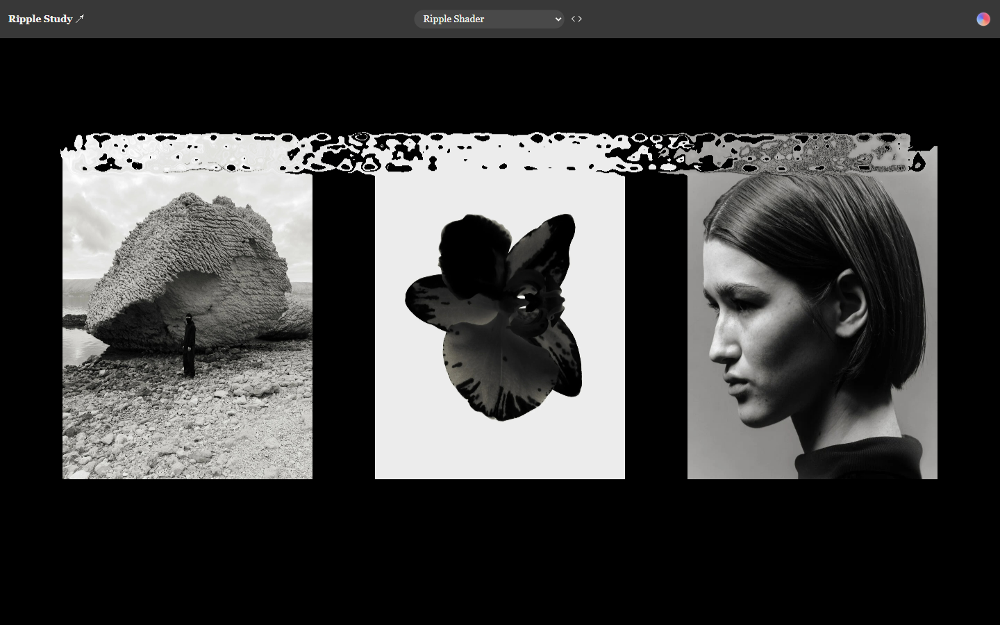

# Ripple Shader — 本地复刻

参照 Olivier Larose 的 Ripple Shader 演示，独立编写的原生 WebGL 交互版本。保留黑色背景、三张黑白图片、横向间距与全画面水波变形，未直接使用原站应用代码。

[返回项目索引](../README.md) · [返回仓库首页](../../README.md)

## 预览



本地复刻实际截图。当前版本 v1.1.0：可见波纹不会被固定槽位覆盖，拖尾沿路径连续生成并自然消散；不是永久保留轨迹。

## 打开方式

- **离线单文件：** 先运行 `npm run build` 生成 `standalone.html`，再双击打开。它将样式、逻辑与图片全部内嵌，不需要联网。导出文件已加入本项目 `.gitignore`，不重复提交构建产物。
- **修改源码：** 编辑 `index.html`、`styles.css` 和 `app.js`，在此目录运行 `npm start`，然后打开终端显示的本地地址。需安装 Node.js，无需 `npm install`。
- 本地服务器只监听 `127.0.0.1`，不会主动向局域网暴露。默认端口 5187。如已被占用，PowerShell 可运行 `$env:PORT='5190'; npm start`。
- `standalone.html` 是导出快照；修改拆分源码后，需运行 `node build.mjs` 重新生成。

在 PowerShell 中启动（Node.js 22+，零第三方依赖）：

```powershell
cd D:\frontend-awesome-collection\projects\ripple-shader
npm start
```

浏览器访问 `http://127.0.0.1:5187/`。校验与单文件导出：

```sh
npm run check
npm test
npm run build
```

## 操作

- 移动鼠标：留下扩散、旋转、逐渐消散的水波。
- 触屏：按下并拖动。
- 顶部下拉框：经典 Ripple Shader / 柔和 Soft Ripple / 强烈 Liquid Distortion。
- 右上角色球：暂停或恢复；灰色代表暂停。
- 空格键：暂停 / 恢复；R：清空波纹。表单控件聚焦时不拦截其原生按键。
- `〈〉`：查看说明，可触发一圈示范波纹；Escape 关闭说明。
- 检测到系统“减少动态效果”偏好时，默认暂停。用户可手动恢复。

## 技术结构

1. `assets.js` 提供三张图片和一张波纹笔刷的内嵌 data URL。
2. `ripple-trail.js` 用动态对象池记录所有尚未消散的波纹，只复用已经淡出的对象，不再用固定 80 个槽位覆盖可见拖尾。采样按累计路径距离进行，无每次事件 12 点的上限，也支持浏览器合并的指针事件。
3. 第一遍渲染将所有笔刷顶点合并到动态顶点缓冲区，一次绘制叠加至半分辨率 framebuffer；第二遍绘制最终画面。有波纹时每帧共 2 次绘制调用，不随波纹数量线性增加调用次数。
4. 第二遍片段着色器根据波纹强度与角度偏移屏幕 UV，再采样图片和矩形边界。因为边界也在偏移之后计算，所以会出现“融化边缘”，而不是只在图片内部扭曲。
5. 按时间步长更新动画，限制像素比与横向渲染分辨率；页面隐藏或全部波纹消失后不继续循环渲染。
6. WebGL 不可用时显示静态图片；图形上下文意外丢失后支持重建。
7. 波纹按透明度自然衰减至不可见后回收，不再使用固定 5 秒强制回收。仅缓存最多 512 个已经不可见的空闲对象；这不是可见波纹上限。所有波纹消散后，过大的顶点缓冲也会缩回初始容量。

没有框架、CDN、分析脚本或第三方运行时依赖。移动端仍采用三列排布以保持参考构图；低高度横屏会缩小图片以免超出视口。

## 本次验证（2026-09-11）

在本机 Chromium 中完成：

- 1440 × 900 桌面显示与指针水波，截图检查图片边缘变形。
- 暂停前后画布截图完全一致。
- R 重置后的画布截图与静态基准完全一致。
- 三档模式切换、说明弹窗、Escape 和示范波纹。
- 390 × 844 移动视口无水平溢出，CDP 模拟触屏事件可改变画布像素。
- 系统减少动态效果时默认暂停。
- 模拟 WebGL 上下文丢失与恢复。
- 模拟 WebGL 不可用时，静态图片正常显示并禁用效果控制。
- 初始化后静止状态不继续请求动画帧。
- 页面加载没有向外部域名发起请求。单文件导出在断网浏览器上下文中也能初始化 WebGL 并响应鼠标。
- JavaScript 语法检查通过，交互测试没有捕获到页面运行错误。

尚未实测 Safari、Firefox 和实体手机；不宣称与原版每一帧完全一致。

## 拖尾修订验证（2026-09-11）

- `npm test`：11 项单元测试通过，包括 600 个可见波纹不覆盖最早对象、3000 个波纹自然回收、空闲缓存有界、对象复用无重复、30/60/120Hz 衰减一致、长距离采样及转弯路径连续性。
- 桌面浏览器：一次快速跨越 1200px 后约 150 个波纹完整保留；连续生成 2550 个波纹，最早对象仍保留且坐标未被覆盖。
- 在上述压力测试中，记录到每帧最多 2 次 WebGL 绘制调用，无 WebGL 错误；这只验证绘制调用数，不承诺所有设备在任意波纹数量下都保持固定帧率。
- 暂停画布像素保持不变，R 重置与静态基准一致；自然消散后活跃数归零并停止请求动画帧。
- 390px 移动视口模拟触屏保留 257 个波纹，无横向溢出；三种模式、减少动态效果偏好、图形上下文恢复后的再次绘制均通过。
- 更新后的单文件在离线浏览器上下文中完成 WebGL 初始化与交互。

拖尾现在仍会自然淡出，不会永久留在画面上；改变的是不再因固定数量而提前截断，而不是让波纹永不消失。

## 参考与素材归属

原演示：https://blog.olivierlarose.com/demos/ripple-shader

为便于视觉对照，此学习演示包含从原演示公开资源取得的以下素材：

- https://blog.olivierlarose.com/medias/demos/ripple-shader/picture2.jpeg （巨石）
- https://blog.olivierlarose.com/medias/demos/ripple-shader/picture3.jpeg （花朵）
- https://blog.olivierlarose.com/medias/demos/ripple-shader/picture1.jpeg （人像）
- https://blog.olivierlarose.com/medias/demos/ripple-shader/ripple.png （波纹笔刷）

图片及笔刷权利属于各自权利人。公开可访问不代表已获商业使用许可。本项目不代表原作者，不附带素材商用授权；公开发布或商业使用前请替换为已获授权的素材。

## 替换图片

`assets.js` 中的 `rock`、`flower`、`portrait`、`brush` 分别对应三张图片及笔刷。可将值替换为自己的图片 data URL，保留无网络依赖的特性；也可改为同源图片路径，此时建议通过本地服务器运行。笔刷需为透明背景 PNG，透明度应有柔和的渐变。

强度参数位于 `app.js` 的 `modes` 对象，图片布局位于 `sceneFragment` 的三个中心位置以及 `draw()` 中的 `cardWidth/cardHeight`。
