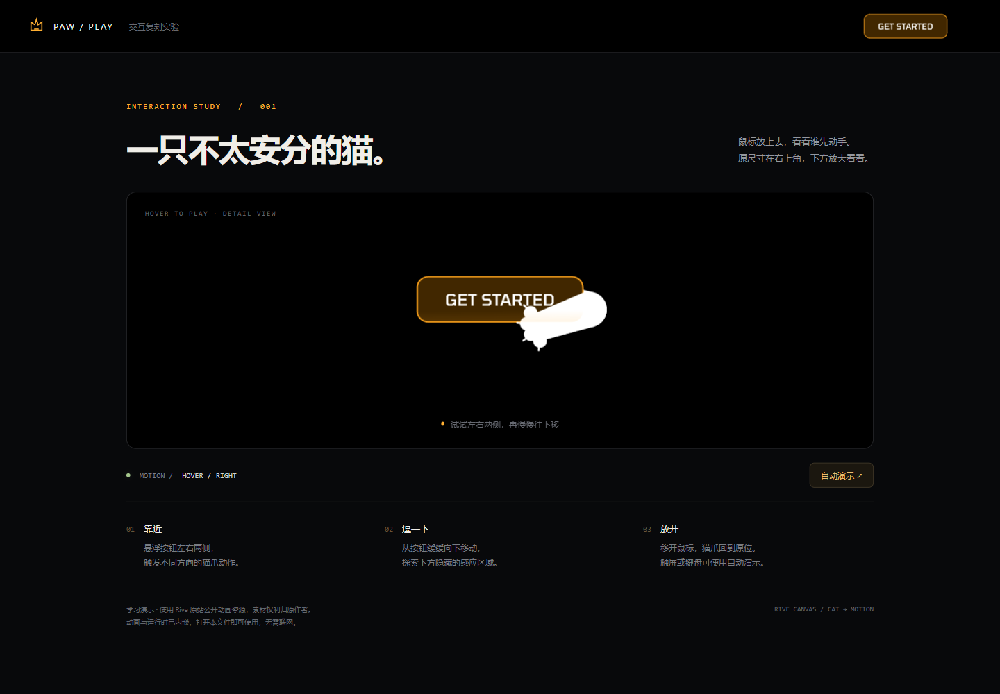

# Rive 猫爪按钮

复用 Rive 原站动画资源，复现 Get Started 按钮的猫爪悬浮交互，并保存为可离线打开的单文件演示。

[返回项目目录](../README.md) · [返回仓库首页](../../README.md)

## 原作与灵感

- 原作：[Rive for game UI](https://rive.app/game-ui)，导航右上角的 Get Started 按钮。
- 原作团队：Rive；该动画的具体作者及单独授权信息尚未核实。
- 学习重点：用透明 HTML 感应区控制 Rive 状态机；让大尺寸透明画布围绕小尺寸按钮绘制动画，而不影响按钮布局。
- 这是局部交互学习演示，不是 Rive 官网完整复刻，也不是官方项目。

## 预览



[原作参考截图](screenshots/reference.png)由用户提供；上图为本次复刻演示的实拍截图。静态截图不能播放动画，请在本机打开演示文件体验。

未部署在线演示。收藏墙仅展示截图、名称与描述，不会启动本项目。

## 实现范围

### 已完成

- 右上角原尺寸按钮与中间放大演示区。
- 左右按钮区域、左右下方区域驱动不同状态机输入。
- 鼠标移开重置输入；提供自动演示、键盘 Enter / 空格触发和 Escape 复位。
- 手机布局与触屏可用的自动演示入口。
- Rive 动画、JavaScript 运行时和 WASM 内嵌到一个 HTML 文件，无需访问外部资源。

### 未实现 / 与原作的差异

- 不包含原站其他页面、导航功能、注册跳转或业务逻辑；点击按钮只提示这是交互演示。
- 猫爪造型和动画直接复用原站公开加载的 `.riv` 文件，不是重新绘制或从头制作动画。
- 展示页排版、放大区、状态提示和自动演示为本次演示增加的内容。
- 归档保留现有实现，不新增收藏墙功能，也不建立统一工程或部署流程。

## 技术栈与本地运行

- 页面：原生 HTML、CSS、JavaScript。
- 运行时：`@rive-app/canvas` **2.36.0**，运行所需文件已归档。
- 查看演示：使用支持 WebAssembly 的现代浏览器，无需 Node.js、Python 或联网。
- 重新构建：Python 3，仅使用标准库；归档时使用 Python 3.12.10 验证。
- 包管理器：无。不需要执行 `npm install`。

### 打开演示

直接用浏览器打开项目根目录的 `index.html`。也可以从仓库根目录执行：

```powershell
Start-Process .\projects\rive-cat-paw\index.html
```

若浏览器对本地文件有额外限制，可使用本机 HTTP 服务：

```powershell
python -m http.server 8766 --bind 127.0.0.1 --directory .\projects\rive-cat-paw
```

访问 `http://127.0.0.1:8766`。这是可选的本地查看方式，不是收藏墙收录的前提。

### 修改与构建

可编辑源码保留在 `scripts/build.py` 的 `html` 模板中，其中包括页面结构、CSS 和交互 JavaScript。原始动画与固定版本运行时位于 `assets/`。

从仓库根目录执行：

```powershell
python .\projects\rive-cat-paw\scripts\build.py
```

脚本根据自身位置寻找资源，将运行时源码和 Base64 编码的动画、WASM 写入项目根目录的 `index.html`。不依赖调用命令时的工作目录，也不依赖原 Codex 临时目录。

`index.html` 是便于直接查看和分享的完整离线文件；修改源码时以构建脚本为准，直接修改 HTML 会在下次构建时被覆盖。

## 文件组织

```text
rive-cat-paw/
├── README.md
├── index.html               # 单文件离线演示
├── scripts/build.py         # 页面模板、交互源码与打包逻辑
├── assets/
│   ├── cat.riv              # 原站动画
│   ├── rive.js              # 固定版本运行时
│   └── rive.wasm
└── screenshots/
    ├── reference.png        # 用户提供的原作参考截图
    └── preview.png          # 复刻效果截图
```

收藏墙封面另存为 `../../showcase/public/covers/rive-cat-paw.png`，尺寸 1280 × 800（16:10）。

## 实现笔记

### 状态机与透明感应区

加载画板 `Cat`、状态机 `Motion`，通过以下布尔输入驱动交互：

| 感应区域 | 输入 |
| --- | --- |
| 按钮左侧 | `isHoverLeft` |
| 按钮右侧 | `isHoverRight` |
| 左下方 | `isHoverLeft2` |
| 右下方 | `isHoverRight2` |

设置状态时只开启一个对应输入，其余复位；文件中的 `isHovercenter` 在本演示中保持关闭。移开感应区后短暂延迟复位，让鼠标有机会进入相邻感应区。

动画 Canvas 大于按钮容器，通过绝对定位和透明背景容纳伸出的猫爪。动画层使用 `pointer-events: none`，鼠标事件由上层 HTML 感应区处理。

### 归档取舍

- 保留原有 HTML 演示和构建脚本，不迁移框架或额外拆分模板。
- 只调整构建路径，确保项目复制后可独立构建。
- 同时保存原始资源与内嵌 HTML，文件存在少量重复，换取可编辑性和单文件离线使用。
- 画廊不填本机绝对路径、临时 localhost 演示链接或尚不存在的线上源码链接。

### 后续可选改进

- 为二次开发按需拆分 HTML、CSS 和 JavaScript；本次未实施。
- 如需商用或重新发布素材，先核实原站动画的许可，或替换为自制动画。

## 归档验证

- 从项目目录之外调用构建脚本成功，生成的 HTML 与迁移前文件 SHA-256 一致。
- 浏览器通过新目录的本地服务验证：四个感应区、移开复位、导航按钮、自动演示、键盘触发与 Escape 复位均通过。
- 加载演示未产生外部或其他子资源请求；390px 手机布局无横向溢出。
- 收藏墙 15 项现有测试通过，构建正确收录 1 个项目；1280 × 800 封面加载正常。
- 收藏墙只加载自身页面和截图资源，不加载猫爪动画或演示文件。

## 素材与致谢

| 内容 | 来源与说明 |
| --- | --- |
| 猫爪造型、按钮视觉及动画 | [Rive 原站公开加载的动画文件](https://public.rive.app/hosted/40850/198254/v5SLt9rntkSw51fMlrBroQ.riv)。公开可访问不等于获得再分发或商用授权；本项目不为该素材声明新的许可证。 |
| `rive.js`、`rive.wasm` | `@rive-app/canvas@2.36.0` 分发文件，来源于 UNPKG；属于第三方运行时，不是本项目原创。保留分发文件原样及其中声明，使用时应遵守上游许可。 |
| 原作参考截图 | 用户提供，仅用于说明复刻目标。 |
| 演示页面、状态驱动、自动演示与打包脚本 | 本次交互复刻实现，基于原站交互观察整理；不代表官方源码。 |
| 预览与收藏墙封面 | 本地复刻演示截图，仍包含原站动画视觉素材。 |

本目录用于学习归档，未确认第三方动画的单独授权范围。商用或公开再分发前应核实相应权限；不要把整个目录视为均由本项目原创或统一授权的素材包。
